# Diagram przepływu autentykacji - Plan My App

<authentication_analysis>
## Analiza systemu autentykacji

### Zidentyfikowane przepływy autentykacji
1. **Rejestracja użytkownika**:
   - Wprowadzenie danych w formularzu rejestracyjnym
   - Walidacja danych po stronie klienta
   - Wysłanie danych do API
   - Utworzenie konta w Supabase Auth
   - Utworzenie profilu użytkownika w bazie danych
   - Wysłanie emaila aktywacyjnego
   - Wyświetlenie komunikatu potwierdzającego

2. **Aktywacja konta**:
   - Kliknięcie w link aktywacyjny w wiadomości email
   - Weryfikacja tokenu aktywacyjnego
   - Aktywacja konta w Supabase Auth
   - Przekierowanie do strony logowania

3. **Logowanie użytkownika**:
   - Wprowadzenie danych logowania
   - Walidacja danych po stronie klienta
   - Wysłanie danych do API
   - Uwierzytelnienie w Supabase Auth
   - Wygenerowanie JWT
   - Zapisanie sesji w tabeli `user_sessions`
   - Przekierowanie do dashboardu

4. **Weryfikacja sesji**:
   - Middleware sprawdza obecność tokenu JWT
   - Weryfikacja ważności tokenu
   - Przekierowanie niezalogowanych użytkowników
   - Ograniczenie dostępu przez polityki RLS w Supabase

5. **Resetowanie hasła**:
   - Wprowadzenie adresu email
   - Wysłanie linku resetującego hasło
   - Kliknięcie w link w wiadomości email
   - Wprowadzenie nowego hasła
   - Aktualizacja hasła w Supabase Auth

6. **Wylogowanie**:
   - Kliknięcie przycisku wylogowania
   - Zakończenie sesji w Supabase Auth
   - Aktualizacja rekordu sesji w bazie danych
   - Przekierowanie do strony logowania

### Główni aktorzy
1. **Przeglądarka** - interfejs użytkownika, formularze React
2. **Middleware** - sprawdzanie sesji, ochrona tras
3. **API Astro** - endpointy obsługujące żądania autentykacji
4. **Supabase Auth** - zewnętrzny serwis autentykacji
5. **Baza danych** - przechowywanie profili i sesji użytkowników

### Procesy weryfikacji i odświeżania tokenów
1. **Weryfikacja tokenu**:
   - Middleware sprawdza obecność sesji w każdym żądaniu
   - Weryfikacja JWT przez Supabase Auth
   - Walidacja polityk RLS dla dostępu do zasobów

2. **Odświeżanie tokenu**:
   - Supabase automatycznie odświeża tokeny przed wygaśnięciem
   - Konfiguracja `refresh_token_reuse_interval` zapobiega nadużyciom
   - Obsługa wygasłych tokenów przez przekierowanie do logowania

3. **Zabezpieczenia**:
   - Hasła są hashowane przez Supabase Auth
   - Limity prób logowania chronią przed atakami brute force
   - Polityki RLS zapewniają dostęp tylko do własnych danych użytkownika

```mermaid
sequenceDiagram
    autonumber
    participant Przeglądarka
    participant Middleware
    participant API as Astro API
    participant Auth as Supabase Auth
    participant DB as Baza Danych

    %% Rejestracja użytkownika
    rect rgb(230, 240, 255)
        Note over Przeglądarka,DB: Rejestracja użytkownika
        Przeglądarka->>+API: Wysłanie formularza rejestracji
        API->>API: Walidacja danych (zod)
        alt Dane niepoprawne
            API-->>Przeglądarka: 400 Bad Request + błędy walidacji
        else Dane poprawne
            API->>+Auth: Utworzenie konta (auth.signUp)
            alt Email zajęty
                Auth-->>API: Błąd - Email już istnieje
                API-->>Przeglądarka: 409 Conflict
            else Sukces
                Auth->>Auth: Generowanie tokenu aktywacyjnego
                Auth-->>-API: Sukces + ID użytkownika
                API->>+DB: Utworzenie profilu użytkownika
                DB-->>-API: Potwierdzenie utworzenia profilu
                API->>Auth: Wysłanie emaila aktywacyjnego
                API-->>Przeglądarka: 201 Created
                Note over Przeglądarka: Wyświetlenie komunikatu o aktywacji
            end
        end
    end

    %% Aktywacja konta
    rect rgb(255, 240, 230)
        Note over Przeglądarka,Auth: Aktywacja konta
        Przeglądarka->>+Auth: Kliknięcie linku aktywacyjnego
        Auth->>Auth: Weryfikacja tokenu
        alt Token wygasł
            Auth-->>Przeglądarka: Błąd - token wygasł
        else Token poprawny
            Auth->>Auth: Aktywacja konta
            Auth-->>Przeglądarka: Przekierowanie do strony logowania
        end
    end

    %% Logowanie
    rect rgb(230, 255, 240)
        Note over Przeglądarka,DB: Logowanie użytkownika
        Przeglądarka->>+API: Wysłanie formularza logowania
        API->>API: Walidacja danych (zod)
        alt Dane niepoprawne
            API-->>Przeglądarka: 400 Bad Request + błędy walidacji
        else Dane poprawne
            API->>+Auth: Logowanie (auth.signInWithPassword)
            alt Niepoprawne dane logowania
                Auth-->>API: 401 Unauthorized
                API-->>Przeglądarka: Błąd logowania
            else Dane poprawne
                Auth->>Auth: Generowanie JWT
                Auth-->>-API: Sukces + session
                API->>+DB: Zapis sesji (user_sessions)
                DB-->>-API: Potwierdzenie zapisu
                API-->>-Przeglądarka: 200 OK + token JWT
                Przeglądarka->>Przeglądarka: Zapisanie tokenu JWT
                Przeglądarka->>Przeglądarka: Przekierowanie do dashboardu
            end
        end
    end

    %% Weryfikacja sesji przy dostępie do chronionych zasobów
    rect rgb(240, 230, 255)
        Note over Przeglądarka,DB: Dostęp do chronionego zasobu
        Przeglądarka->>+Middleware: Żądanie dostępu do chronionego zasobu
        Middleware->>+Auth: Sprawdzenie sesji
        Auth->>Auth: Weryfikacja JWT
        alt Brak sesji lub token wygasł
            Auth-->>-Middleware: Brak aktywnej sesji
            Middleware-->>Przeglądarka: Przekierowanie do strony logowania
        else Token ważny
            Auth-->>-Middleware: Sesja aktywna
            Middleware->>+API: Przekazanie żądania
            API->>+DB: Dostęp do danych (z RLS)
            DB->>DB: Weryfikacja polityk dostępu
            DB-->>-API: Dane użytkownika
            API-->>-Przeglądarka: Odpowiedź z danymi
        end
    end

    %% Resetowanie hasła
    rect rgb(255, 255, 230)
        Note over Przeglądarka,Auth: Resetowanie hasła
        Przeglądarka->>+API: Żądanie resetowania hasła
        API->>API: Walidacja adresu email
        API->>+Auth: resetPasswordForEmail
        Auth->>Auth: Generowanie tokenu resetującego
        Auth->>Auth: Wysłanie emaila z linkiem
        Auth-->>-API: Potwierdzenie
        API-->>-Przeglądarka: Komunikat o wysłaniu linku
        
        Przeglądarka->>+Auth: Kliknięcie linku resetującego
        Auth->>Auth: Weryfikacja tokenu
        Auth-->>-Przeglądarka: Przekierowanie do formularza zmiany hasła
        
        Przeglądarka->>+API: Wysłanie nowego hasła
        API->>API: Walidacja hasła
        API->>+Auth: updateUser (nowe hasło)
        Auth->>Auth: Aktualizacja hasła
        Auth-->>-API: Potwierdzenie zmiany
        API-->>-Przeglądarka: Przekierowanie do strony logowania
    end

    %% Wylogowanie
    rect rgb(255, 230, 245)
        Note over Przeglądarka,DB: Wylogowanie
        Przeglądarka->>+API: Żądanie wylogowania
        API->>+Auth: auth.signOut()
        Auth->>Auth: Unieważnienie tokenu
        Auth-->>-API: Potwierdzenie
        API->>+DB: Aktualizacja rekordu sesji
        DB-->>-API: Potwierdzenie aktualizacji
        API-->>-Przeglądarka: Potwierdzenie wylogowania
        Przeglądarka->>Przeglądarka: Usunięcie lokalnego tokenu
        Przeglądarka->>Przeglądarka: Przekierowanie do strony logowania
    end

    %% Odświeżanie tokenu
    rect rgb(230, 255, 255)
        Note over Przeglądarka,Auth: Odświeżanie tokenu
        Przeglądarka->>+Auth: Automatyczne odświeżenie tokenu
        Auth->>Auth: Weryfikacja refresh tokenu
        alt Token odświeżania ważny
            Auth->>Auth: Generowanie nowego JWT
            Auth-->>-Przeglądarka: Nowy token JWT
        else Token odświeżania wygasł
            Auth-->>Przeglądarka: 401 Unauthorized
            Przeglądarka->>Przeglądarka: Przekierowanie do logowania
        end
    end
```

</authentication_analysis>

<mermaid_diagram>

</mermaid_diagram>

## Opis przepływu autentykacji

Diagram przedstawia kompletny przepływ procesów autentykacji w aplikacji Plan My App, obejmujący:

1. **Rejestrację użytkownika** - proces tworzenia nowego konta, włącznie z walidacją danych, tworzeniem użytkownika w Supabase Auth, zapisem profilu w bazie danych oraz wysłaniem emaila aktywacyjnego.

2. **Aktywację konta** - weryfikację adresu email poprzez kliknięcie linku aktywacyjnego, co prowadzi do aktywacji konta w systemie.

3. **Logowanie** - proces uwierzytelniania użytkownika, generowania tokenu JWT oraz zapisywania informacji o sesji.

4. **Weryfikację sesji** - middleware sprawdzający stan uwierzytelnienia użytkownika przy dostępie do chronionych zasobów, z obsługą przekierowań w przypadku braku sesji.

5. **Resetowanie hasła** - trzyetapowy proces umożliwiający użytkownikowi odzyskanie dostępu do konta poprzez zresetowanie hasła.

6. **Wylogowanie** - bezpieczne zakończenie sesji użytkownika, unieważnienie tokenu oraz aktualizację rekordu sesji w bazie danych.

7. **Odświeżanie tokenu** - automatyczny proces przedłużania ważności sesji dla zalogowanych użytkowników.

Diagram ilustruje interakcje między głównymi komponentami systemu: przeglądarką użytkownika, middleware Astro, API Astro, usługą Supabase Auth oraz bazą danych. Pokazuje również obsługę typowych scenariuszy błędów, takich jak niepoprawne dane logowania, zajęty adres email czy wygasłe tokeny.

Implementacja została zaprojektowana zgodnie z najlepszymi praktykami bezpieczeństwa, wykorzystując hashowanie haseł, tokeny JWT, Row Level Security (RLS) oraz walidację danych wejściowych za pomocą biblioteki zod.