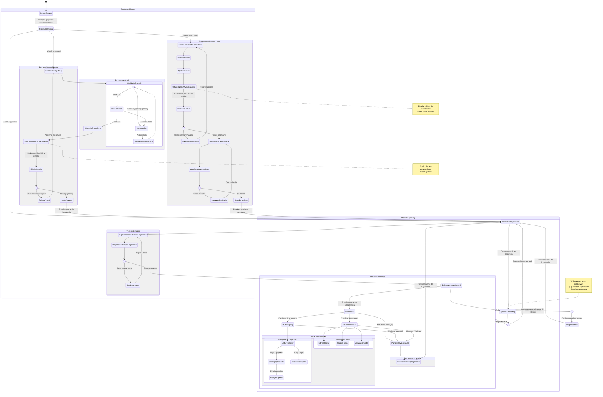

# Diagram podróży użytkownika - autentykacja

<user_journey_analysis>
## Analiza podróży użytkownika

### 1. Zidentyfikowane ścieżki użytkownika
Na podstawie plików referencyjnych zidentyfikowano następujące ścieżki użytkownika:

1. **Rejestracja nowego użytkownika (US-001)**:
   - Wypełnienie formularza rejestracyjnego (email, hasło, imię)
   - Walidacja danych w czasie rzeczywistym
   - Wysłanie formularza i utworzenie konta
   - Otrzymanie emaila z linkiem aktywacyjnym
   - Aktywacja konta poprzez kliknięcie linku

2. **Logowanie do systemu (US-002)**:
   - Wprowadzenie danych logowania (email i hasło)
   - Weryfikacja poprawności danych
   - Przekierowanie po poprawnym logowaniu lub wyświetlenie błędu

3. **Odzyskiwanie hasła (US-003)**:
   - Inicjacja procesu odzyskiwania hasła
   - Podanie adresu email
   - Otrzymanie emaila z linkiem do resetowania hasła
   - Ustawienie nowego hasła
   - Potwierdzenie zmiany hasła

4. **Korzystanie z aplikacji jako zalogowany użytkownik**:
   - Dostęp do funkcjonalności dla zalogowanych użytkowników
   - Automatyczna weryfikacja sesji przy dostępie do chronionych zasobów
   - Odświeżanie tokenu autoryzacyjnego
   - Wylogowanie z systemu

### 2. Główne podróże i stany

#### Podróż 1: Rejestracja i aktywacja konta
Stany:
- Strona główna (punkt wejścia)
- Formularz rejestracji
- Walidacja danych rejestracyjnych
- Potwierdzenie rejestracji
- Oczekiwanie na aktywację
- Aktywacja konta
- Przekierowanie do logowania

#### Podróż 2: Logowanie i korzystanie z aplikacji
Stany:
- Formularz logowania
- Walidacja danych logowania
- Panel główny aplikacji (Dashboard)
- Korzystanie z funkcji aplikacji
- Wylogowanie

#### Podróż 3: Odzyskiwanie hasła
Stany:
- Formularz resetowania hasła
- Podanie adresu email
- Potwierdzenie wysłania linku
- Formularz ustawienia nowego hasła
- Potwierdzenie zmiany hasła
- Przekierowanie do logowania

### 3. Punkty decyzyjne i alternatywne ścieżki

#### Punkty decyzyjne w procesie rejestracji:
- Czy adres email jest unikalny?
- Czy hasło spełnia wymagania bezpieczeństwa?
- Czy użytkownik potwierdził adres email?

#### Punkty decyzyjne w procesie logowania:
- Czy dane logowania są poprawne?
- Czy konto zostało aktywowane?

#### Punkty decyzyjne w procesie resetowania hasła:
- Czy podany email istnieje w systemie?
- Czy token resetujący hasło jest ważny?
- Czy nowe hasło spełnia wymagania bezpieczeństwa?

#### Punkty decyzyjne w korzystaniu z aplikacji:
- Czy sesja użytkownika jest aktywna?
- Czy token JWT jest ważny?

### 4. Cel każdego stanu

- **Strona główna**: Zapoznanie użytkownika z aplikacją i umożliwienie przejścia do rejestracji/logowania
- **Formularz rejestracji**: Zebranie danych niezbędnych do utworzenia konta
- **Walidacja danych rejestracyjnych**: Zapewnienie poprawności i bezpieczeństwa danych
- **Potwierdzenie rejestracji**: Informacja o konieczności aktywacji konta
- **Aktywacja konta**: Weryfikacja adresu email i aktywacja konta
- **Formularz logowania**: Wprowadzenie danych uwierzytelniających
- **Panel główny aplikacji**: Centralny punkt dostępu do funkcji aplikacji
- **Formularz resetowania hasła**: Inicjacja procesu odzyskiwania dostępu
- **Formularz ustawienia nowego hasła**: Wprowadzenie nowego, bezpiecznego hasła
- **Wylogowanie**: Zakończenie sesji i zabezpieczenie konta
</user_journey_analysis>

<mermaid_diagram>

</mermaid_diagram>

Diagram przedstawia kompletną podróż użytkownika przez system autentykacji w aplikacji Plan My App, obejmując następujące główne procesy:

1. **Rejestracja i aktywacja konta** - proces utworzenia nowego konta użytkownika, wraz z walidacją danych wejściowych, wysłaniem emaila aktywacyjnego i aktywacją konta poprzez link.

2. **Logowanie do systemu** - proces uwierzytelniania użytkownika, weryfikacja danych logowania i przekierowanie do panelu głównego aplikacji.

3. **Resetowanie hasła** - wieloetapowy proces umożliwiający użytkownikowi odzyskanie dostępu do konta w przypadku zapomnienia hasła.

4. **Korzystanie z obszaru chronionego** - poruszanie się po funkcjach aplikacji dostępnych dla zalogowanych użytkowników, z uwzględnieniem zarządzania projektami i ustawieniami konta.

5. **Weryfikacja sesji** - automatyczny proces sprawdzania stanu sesji użytkownika przy dostępie do chronionych zasobów, z obsługą wygasania sesji i automatycznym odświeżaniem tokenu.

6. **Wylogowanie** - bezpieczne zakończenie sesji użytkownika i powrót do formularza logowania.

Diagram uwzględnia również różne punkty decyzyjne i alternatywne ścieżki, takie jak niepoprawne dane logowania, wygasłe tokeny czy błędy walidacji. Przedstawiona jest także struktura obszaru publicznego i chronionego aplikacji, zgodnie z wymaganiami określonymi w dokumentacji projektowej.