# Diagram architektury interfejsu użytkownika dla systemu autentykacji

<architecture_analysis>
## Analiza architektury uwierzytelniania

### 1. Zidentyfikowane komponenty

#### Strony Astro
1. **Strona logowania** (`src/pages/auth/login.astro`)
   - Statyczna strona zawierająca komponent formularza logowania
   - Obsługa przekierowania po udanym logowaniu
   - Sprawdzanie stanu sesji i przekierowanie zalogowanych użytkowników

2. **Strona rejestracji** (`src/pages/auth/register.astro`)
   - Statyczna strona zawierająca komponent formularza rejestracji
   - Obsługa walidacji danych wejściowych
   - Wyświetlanie informacji o konieczności aktywacji konta przez email

3. **Strona resetowania hasła** (`src/pages/auth/reset-password.astro`)
   - Formularz do wprowadzenia adresu email
   - Potwierdzenie wysłania linku resetowania hasła

4. **Strona ustawienia nowego hasła** (`src/pages/auth/new-password.astro`)
   - Formularz do ustawienia nowego hasła
   - Walidacja siły hasła
   - Obsługa błędów resetowania

5. **Strona aktywacji konta** (`src/pages/auth/activate.astro`)
   - Obsługa tokenu aktywacyjnego z URL
   - Potwierdzenie aktywacji konta
   - Przekierowanie do strony logowania

#### Komponenty React
1. **Formularz logowania** (`src/components/auth/LoginForm.tsx`)
   - Pola formularza: email, hasło
   - Walidacja danych wejściowych
   - Obsługa błędów
   - Przycisk "Zapamiętaj mnie"
   - Link do resetowania hasła

2. **Formularz rejestracji** (`src/components/auth/RegisterForm.tsx`)
   - Pola formularza: email, hasło, powtórz hasło, imię
   - Walidacja siły hasła
   - Walidacja powtórzonego hasła
   - Walidacja poprawności adresu email
   - Obsługa błędów

3. **Formularz resetowania hasła** (`src/components/auth/ResetPasswordForm.tsx`)
   - Pole formularza: email
   - Walidacja adresu email
   - Obsługa stanu wysłanego maila

4. **Formularz ustawienia nowego hasła** (`src/components/auth/NewPasswordForm.tsx`)
   - Pola formularza: nowe hasło, powtórz hasło
   - Walidacja siły nowego hasła
   - Walidacja zgodności haseł
   - Obsługa błędów

5. **Przycisk wylogowania** (`src/components/auth/LogoutButton.tsx`)
   - Obsługa wylogowania użytkownika
   - Przekierowanie po wylogowaniu

#### API Endpoints
1. **Rejestracja** (`/api/auth/register`)
2. **Logowanie** (`/api/auth/login`)
3. **Wylogowanie** (`/api/auth/logout`)
4. **Resetowanie hasła** (`/api/auth/reset-password`)
5. **Ustawienie nowego hasła** (`/api/auth/new-password`)
6. **Weryfikacja sesji** (`/api/auth/session`)

#### Serwisy
1. **Serwis autentykacji** (`src/lib/services/auth.service.ts`)
   - Rejestracja użytkownika
   - Logowanie użytkownika
   - Wylogowanie użytkownika
   - Resetowanie hasła
   - Ustawienie nowego hasła
   - Potwierdzenie adresu email

2. **Serwis obsługi błędów** (`src/lib/services/error.service.ts`)
   - Centralna obsługa błędów
   - Mapowanie błędów na kody HTTP

#### Middleware
1. **Middleware autentykacji** (`src/middleware/auth.middleware.ts`)
   - Sprawdzanie stanu sesji
   - Ochrona stron wymagających autoryzacji
   - Przekierowanie niezalogowanych użytkowników

#### Komponenty modyfikowane
1. **Layout** (`src/layouts/Layout.astro`)
   - Dodanie sprawdzania stanu sesji
   - Wyświetlanie odpowiedniego nagłówka dla zalogowanego/niezalogowanego użytkownika

2. **AppHeader** (`src/components/dashboard/AppHeader.astro`)
   - Dodanie przycisku wylogowania dla zalogowanego użytkownika
   - Kondycyjne wyświetlanie elementów w zależności od stanu logowania

### 2. Przepływ danych

#### Rejestracja
1. Użytkownik wypełnia formularz rejestracyjny na stronie register.astro
2. Formularz RegisterForm wysyła dane do /api/auth/register
3. Endpoint wykonuje walidację i wywołuje AuthService.register()
4. AuthService tworzy konto w Supabase Auth i profil użytkownika
5. Użytkownik otrzymuje potwierdzenie i informację o konieczności aktywacji konta

#### Logowanie
1. Użytkownik wypełnia formularz logowania na stronie login.astro
2. Formularz LoginForm wysyła dane do /api/auth/login
3. Endpoint wykonuje walidację i wywołuje AuthService.login()
4. AuthService loguje użytkownika przez Supabase Auth i tworzy sesję
5. Użytkownik jest przekierowywany do dashboardu

#### Resetowanie hasła
1. Użytkownik wprowadza email na stronie reset-password.astro
2. Formularz ResetPasswordForm wysyła dane do /api/auth/reset-password
3. Endpoint wywołuje AuthService.resetPassword()
4. Supabase wysyła email z linkiem resetującym
5. Użytkownik klika w link i przechodzi do new-password.astro
6. Formularz NewPasswordForm wysyła dane do /api/auth/new-password
7. Endpoint wywołuje AuthService.setNewPassword()
8. Użytkownik jest przekierowywany do logowania

#### Wylogowanie
1. Użytkownik klika przycisk wylogowania (LogoutButton)
2. Komponent wysyła żądanie do /api/auth/logout
3. Endpoint wywołuje AuthService.logout()
4. Supabase Auth kończy sesję użytkownika
5. Użytkownik jest przekierowywany do strony logowania

### 3. Integracja z istniejącymi komponentami

1. Layout.astro wykorzystuje dane sesji do wyświetlania odpowiednich elementów
2. AppHeader.astro zawiera LogoutButton dla zalogowanych użytkowników
3. Middleware auth.middleware.ts chroni dostęp do stron wymagających autoryzacji
4. RLS (Row Level Security) ogranicza dostęp do danych w bazie dla niezalogowanych użytkowników

```mermaid
flowchart TD
    %% Style definitions
    classDef astroPage fill:#f9d4ab,stroke:#333,stroke-width:1px
    classDef reactComponent fill:#d4f9ab,stroke:#333,stroke-width:1px
    classDef apiEndpoint fill:#abd4f9,stroke:#333,stroke-width:1px
    classDef service fill:#d4abf9,stroke:#333,stroke-width:1px
    classDef database fill:#f9abb4,stroke:#333,stroke-width:1px
    classDef middleware fill:#abf9f9,stroke:#333,stroke-width:1px
    classDef sharedComponent fill:#f9f9ab,stroke:#333,stroke-width:1px

    %% Main groups
    subgraph "Strony Astro"
        LoginPage["login.astro"]
        RegisterPage["register.astro"]
        ResetPasswordPage["reset-password.astro"]
        NewPasswordPage["new-password.astro"]
        ActivatePage["activate.astro"]
    end

    subgraph "Komponenty React"
        LoginForm["LoginForm.tsx"]
        RegisterForm["RegisterForm.tsx"]
        ResetPasswordForm["ResetPasswordForm.tsx"]
        NewPasswordForm["NewPasswordForm.tsx"]
        LogoutButton["LogoutButton.tsx"]
    end

    subgraph "API Endpoints"
        RegisterAPI["/api/auth/register"]
        LoginAPI["/api/auth/login"]
        LogoutAPI["/api/auth/logout"]
        ResetPasswordAPI["/api/auth/reset-password"]
        NewPasswordAPI["/api/auth/new-password"]
        SessionAPI["/api/auth/session"]
    end

    subgraph "Serwisy"
        AuthService["auth.service.ts"]
        ErrorService["error.service.ts"]
        AuthErrors["auth.errors.ts"]
        AuthSchema["auth.schema.ts"]
    end

    subgraph "Middleware"
        AuthMiddleware["auth.middleware.ts"]
        MainMiddleware["index.ts"]
    end

    subgraph "Komponenty współdzielone"
        Layout["Layout.astro"]
        AppHeader["AppHeader.astro"]
    end

    subgraph "Zewnętrzne usługi"
        SupabaseAuth["Supabase Auth"]
        SupabaseDB["Supabase Database"]
    end

    %% Connections for Login flow
    LoginPage --> LoginForm
    LoginForm --"POST"--> LoginAPI
    LoginAPI --> AuthService
    AuthService --> SupabaseAuth
    SupabaseAuth --"JWT Token"--> AuthService
    AuthService --"Zapisanie sesji"--> SupabaseDB
    LoginAPI --"Udane logowanie"--> Dashboard["Dashboard"]
    LoginForm --"Link do rejestracji"--> RegisterPage
    LoginForm --"Zapomniałem hasła"--> ResetPasswordPage

    %% Connections for Registration flow
    RegisterPage --> RegisterForm
    RegisterForm --"POST"--> RegisterAPI
    RegisterAPI --> AuthService
    AuthService --"Utworzenie konta"--> SupabaseAuth
    AuthService --"Utworzenie profilu"--> SupabaseDB
    SupabaseAuth --"Email aktywacyjny"--> UserEmail["Email użytkownika"]
    UserEmail --"Kliknięcie linku"--> ActivatePage
    ActivatePage --> SupabaseAuth
    ActivatePage --"Po aktywacji"--> LoginPage
    RegisterForm --"Masz już konto?"--> LoginPage

    %% Connections for Password Reset flow
    ResetPasswordPage --> ResetPasswordForm
    ResetPasswordForm --"POST"--> ResetPasswordAPI
    ResetPasswordAPI --> AuthService
    AuthService --"Reset hasła"--> SupabaseAuth
    SupabaseAuth --"Email z linkiem"--> UserEmail
    UserEmail --"Kliknięcie linku"--> NewPasswordPage
    NewPasswordPage --> NewPasswordForm
    NewPasswordForm --"POST"--> NewPasswordAPI
    NewPasswordAPI --> AuthService
    AuthService --"Zmiana hasła"--> SupabaseAuth
    NewPasswordAPI --"Po zmianie hasła"--> LoginPage

    %% Connections for Logout flow
    AppHeader --> LogoutButton
    LogoutButton --"POST"--> LogoutAPI
    LogoutAPI --> AuthService
    AuthService --"Wylogowanie"--> SupabaseAuth
    AuthService --"Aktualizacja sesji"--> SupabaseDB
    LogoutAPI --"Po wylogowaniu"--> LoginPage

    %% Connections for Session verification
    AuthMiddleware --"Sprawdzenie sesji"--> SessionAPI
    SessionAPI --> SupabaseAuth
    MainMiddleware --"Ochrona stron"--> AuthMiddleware
    Layout --"Sprawdzenie stanu logowania"--> SessionAPI
    
    %% Connections for Shared components
    Layout --"Wyświetla"--> AppHeader
    Dashboard --"Używa"--> Layout
    LoginPage --"Używa"--> Layout
    RegisterPage --"Używa"--> Layout
    ResetPasswordPage --"Używa"--> Layout
    NewPasswordPage --"Używa"--> Layout
    ActivatePage --"Używa"--> Layout

    %% Service connections
    AuthService --"Używa"--> AuthErrors
    AuthService --"Używa"--> AuthSchema
    RegisterAPI --"Używa"--> ErrorService
    LoginAPI --"Używa"--> ErrorService
    LogoutAPI --"Używa"--> ErrorService
    ResetPasswordAPI --"Używa"--> ErrorService
    NewPasswordAPI --"Używa"--> ErrorService
    SessionAPI --"Używa"--> ErrorService
    ErrorService --"Obsługa"--> AuthErrors

    %% Apply styles
    LoginPage:::astroPage
    RegisterPage:::astroPage
    ResetPasswordPage:::astroPage
    NewPasswordPage:::astroPage
    ActivatePage:::astroPage
    
    LoginForm:::reactComponent
    RegisterForm:::reactComponent
    ResetPasswordForm:::reactComponent
    NewPasswordForm:::reactComponent
    LogoutButton:::reactComponent
    
    RegisterAPI:::apiEndpoint
    LoginAPI:::apiEndpoint
    LogoutAPI:::apiEndpoint
    ResetPasswordAPI:::apiEndpoint
    NewPasswordAPI:::apiEndpoint
    SessionAPI:::apiEndpoint
    
    AuthService:::service
    ErrorService:::service
    AuthErrors:::service
    AuthSchema:::service
    
    AuthMiddleware:::middleware
    MainMiddleware:::middleware
    
    Layout:::sharedComponent
    AppHeader:::sharedComponent
    
    SupabaseAuth:::database
    SupabaseDB:::database
```

</architecture_analysis>

<mermaid_diagram>

</mermaid_diagram>